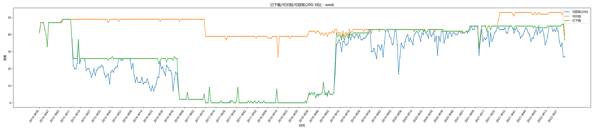

# HitFM 阿基米德下载计划 · 最终报告
**日期：2026年4月3日**

*此项目是为了纪念Hit FM而生，也同样为了纪念那些离我们而去的声音。*

*这个我从小学就开始听、陪伴了我近9年的电台，在2025年12月23日零时，永久沉寂了。*

*在曲终人散之时，趁着阿基米德尚存有Hit FM的回放，故写这样一个下载器，保存下来曾经的回忆。*

经过数天的努力，我单方面宣布——**HitFM 阿基米德下载计划正式以一半成功告终**。以下是下载结果与复盘分析。

---

## 下载结果

阿基米德平台现存 HitFM 节目覆盖 **2014年9月22日 ～ 2022年7月1日**，共计 2837 天，统计共 **18,227 条**节目。

| 指标 | 数量 | 占比 |
|------|------|------|
| 已完成下载 | 11,156 条 | 61.21% |
| 实际可获取 | 9,781 条 | 53.66% |

换句话说，**将近 4 成的节目已经永久失去了**。由于 CDN 缓存仍在持续失效，实际可获取的数量还会继续减少。

**保存情况分布：**

- ✅ **保存较完整**：2014年9月中旬 ～ 2015年3月中旬、2019年2月中旬 ～ 2022年7月（仅 2021年7月中旬 ～ 2022年7月的 Music Flow 因下载不及时有所缺失）
- ❌ **缺失最严重**：2016年2月初 ～ 2019年2月初，几乎无节目留存，堪称灾难

*能解析/已保存/尚可保存按周整理对比图。*

*时间4月3日凌晨。黄线是能解析到的节目，绿线是已经下载保存的，蓝线是还能获取到的*
> 

---

## 项目时间线

### 3月28日（周六）· 破壳

> 晚上，通过逆向破解阿基米德 app，成功截获 API 接口，获取节目信息与下载地址。

### 3月29日（周日）· 启动

> 凌晨，项目正式启动。

> 迁移云听下载器代码框架，针对新 API 进行适配与文档补充，开始首次爬取尝试。

### 3月30日（周一）· 埋雷

> 晚上，优化 info 保存逻辑，但引入重大 bug。

> 从 2022 年和 2014 年两端向中间大批量下载节目的同时，发现由于 `c_id` 搜索不全、早期节目单差异较大，时间久远节目的解析成功率极低。

### 3月31日（周二）· 转折

> 凌晨，在贴吧历史帖中找到数年前节目单时间表及完整 `c_id` 对照，节目信息补全。

> ⚠️ **13:35 —— 源站正式进入 `DeepColdArchive` 模式，HitFM 节目实质性下线。**

> 下午测试时大量节目出现 403 错误，初步误判为风控限流；经二次抓包确认，真实原因为 **CDN 节点缓存失效**。随即更新下载逻辑，立即对所有剩余节目发起 403 状态解析并优先处理。

### 4月1日（周三）· 抢救

> 修复 info 更新 bug，发布 README 悲报公告，新增遍历多 CDN 节点功能，下载工作基本结束。

### 4月2日（周四）· 收尾

> 利用新增的指定 CDN 节点解析功能重新扫描全部节目状态，确认已无更多节目可获取，下载进程正式结束。

### 4月3日（周五）· 归档

> 凌晨上传全部工程文件与脚本，绘制解析结果统计图；晚上完成项目总结，宣布计划正式结束。

---

## 复盘分析

### 1. 时间因素

我在约 3 周前才得知 HitFM 停播一事，先行完成了云听节目的完整保存，上周末才开始着手分析阿基米德。整体节奏并无明显拖沓，但恰好撞上平台突然归档，放大了计划的遗憾之处。即便在理想条件下，以实际文件体量和下载速度估算，完整保存全部节目至少也需要 2 天，几乎难以实现。

### 2. 紧急程度误判

云听约于一月份隐藏 HitFM 入口，但至今仍可正常访问，这让我形成了"隐藏入口不等于删除"的惯性认知。当阿基米德同样隐藏入口、乃至有网友称节目已被删除时，我仍沿用了这一判断，低估了紧急程度，错失了提前行动的窗口。

### 3. 脚本 bug 导致大量重复下载

3月30日优化 info 保存逻辑时，因与 AI 协作过程中信息不对称，配置中所有含两个 `c_id` 的节目均被重复保存多次，额外消耗约 **260GB** 存储空间，大量浪费带宽并阻塞正常下载队列，直接拉低了 30、31 日的有效保存数量。

### 4. CDN 节点切换思路出现延误

得知 CDN 缓存失效导致 403 后，我的第一反应是请求各地网友协助碰缓存，却忽略了自己同样可以通过**指定连接 IP 直接访问其他地区 CDN 节点**的方案，直到一天后才想到并实施，白白错过了约 24 小时的黄金窗口。

### 5. 下载规划存在一定失误

3月31日凌晨，在获取节目信息的同时，我已得知 ezfm 同样留存有 HitFM 节目（覆盖 2020年9月 ～ 2021年12月），但由于该时间段节目彼时已基本保存完毕，未对结果造成严重影响。

---

## 尚存疑点

按照我的下载策略（从头尾两端及中间向外推进），理论上不应出现 **2016 ～ 2018 年**的大面积断档。目前推测两种可能：一是阿基米德实际归档时间早于31日，当天显示的时间戳可能是由普通归档切换至深度冷归档时被覆盖；二是 CDN 缓存时间与访问行为强相关——中部节目在归档前几乎从未被访问，缓存本就较短，归档后数小时内便彻底失效。这一问题尚无定论。

---

## 总结

本计划的失误，既有来自平台突然归档的**天灾**，也有人为因素造成的**人祸**（误判紧急程度、脚本 bug、策略延误）。留下三点经验：

1. **珍惜当下** —— 别等到最后才想起挽留，数字资产消失往往比预期更快；
2. **重视一手情报** —— 此前有网友称阿基米德已删除节目，或许并非空穴来风；
3. **不要过分依赖 AI** —— 虽然本计划绝大部分代码由 AI 生成，但 info 重复存储事件的根本原因仍是沟通和测试不到位，是完全可以避免的失误。

---

鉴于源站深度冷归档短期内不可能恢复，各地 CDN 缓存也已基本爬取完毕，**本计划至此正式结束**。

那些抢救回来的 9000 余条节目，是这段时光留下来的一点痕迹。能救多少是多少——至少，它们还在。

感谢所有参与和支持本计划的朋友。后续将从 **ezfm app** 着手分析，尽可能补全剩余内容，并考虑从互联网档案馆等渠道进一步挖掘。